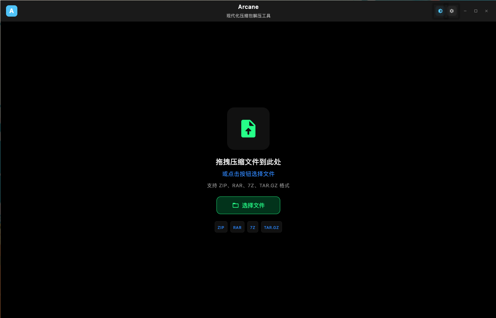

# Arcane - 压缩包解压工具

一个基于 Jetpack Compose for Desktop 构建的现代化跨平台压缩包解压工具。



## 功能特性

### ✅ 已实现功能 (MVP v0.1)
- [x] **现代化 UI**: 使用 Jetpack Compose for Desktop 和 Material 3 设计
- [x] **多格式支持**: 支持 ZIP、7Z、RAR、TAR.GZ 格式
- [x] **文件树视图**: 以分层结构浏览压缩包内容
- [x] **选择性解压**: 选择特定文件/文件夹进行解压
- [x] **进度跟踪**: 实时显示解压进度和文件数量
- [x] **目录选择**: 选择解压输出目录
- [x] **错误处理**: 全面的错误报告和验证
- [x] **主题支持**: Material 3 明亮/暗黑主题支持
- [x] **跨平台**: 支持 macOS、Windows 和 Linux
- [x] **现代化设计**: 渐变背景、动画效果、无间隙布局
- [x] **自定义头部**: 现代化的应用程序头部设计
- [x] **Toast 提示**: 优雅的错误提示系统

### 🚧 开发中
- [x] **文件选择器**: 完整的压缩包文件选择支持
- [ ] **真正的拖拽**: 原生拖拽文件到窗口功能
- [ ] **文件预览**: 预览压缩包内的文本文件和图像
- [ ] **批量操作**: 同时处理多个压缩包

### 📋 计划功能
- [ ] **应用打包**: 原生应用程序包 (.dmg、.exe、.AppImage)
- [ ] **性能优化**: 针对大型压缩包的优化
- [ ] **压缩功能**: 创建新的压缩包
- [ ] **加密支持**: 支持密码保护的压缩包

## 快速开始

### 前置要求
- Java 21 或更高版本
- Gradle（或使用包含的包装器）

### 运行应用程序
```bash
# 克隆仓库
git clone <repository-url>
cd Arcane

# 运行应用程序
./gradlew run
```

### 构建应用程序
```bash
# 构建项目
./gradlew build

# 打包分发（计划中）
./gradlew package
```

## 项目架构

### 项目结构
```
src/main/kotlin/com/arcane/
├── Main.kt                 # 应用程序入口
├── model/                  # 数据模型
│   └── ArchiveModel.kt
├── service/                # 压缩包处理服务
│   ├── ArchiveService.kt
│   ├── ArchiveDetector.kt
│   ├── ZipArchiveService.kt
│   ├── SevenZipArchiveService.kt
│   ├── RarArchiveService.kt
│   └── TarGzArchiveService.kt
├── viewmodel/              # UI 状态管理
│   └── MainViewModel.kt
├── ui/
│   ├── components/         # 可复用 UI 组件
│   │   ├── DropZone.kt
│   │   ├── FileTree.kt
│   │   └── ExtractionPanel.kt
│   ├── screens/            # 应用程序屏幕
│   │   └── MainScreen.kt
│   └── theme/              # Material 3 主题
│       ├── Theme.kt
│       └── Type.kt
```

### 使用技术
- **Jetpack Compose for Desktop**: 现代化 UI 框架
- **Material 3**: 设计系统和组件
- **Kotlin Coroutines**: 异步编程
- **压缩库**:
  - `java.util.zip`: ZIP 文件支持
  - `commons-compress`: TAR.GZ 支持
  - `sevenzipjbinding`: 7Z 文件支持
  - `junrar`: RAR 文件支持

## 测试

应用程序包含一个测试压缩包 (`test_archive.zip`) 用于测试功能。

## 贡献

1. Fork 仓库
2. 创建功能分支
3. 进行修改
4. 彻底测试
5. 提交 pull request

## 许可证

该项目采用 MIT 许可证。

## 截图

*即将推出 - 应用程序运行截图*

## 已知问题

- 目前使用文件选择器而非原生拖拽功能
- 某些图标引用可能需要 Material Icons Extended 依赖
- 大型压缩包可能需要性能优化

## 开发与构建

### 开发环境
- Java 21+
- Kotlin 1.9+
- Gradle 8.5+

### 构建命令
```bash
# 编译项目
./gradlew build

# 运行应用
./gradlew run

# 打包应用 (计划中)
./gradlew packageDmg    # macOS
./gradlew packageMsi    # Windows
./gradlew packageDeb    # Linux
```

### 项目依赖
- **Jetpack Compose for Desktop**: 现代化 UI 框架
- **Material 3**: 设计系统和组件
- **Kotlin Coroutines**: 异步编程支持
- **Commons Compress**: TAR.GZ 格式支持
- **SevenZipJBinding**: 7Z 格式支持
- **JUnrar**: RAR 格式支持

### 目录结构说明
- `gradle/` - Gradle Wrapper 配置文件（必需）
- `gradle-8.5/` - 如果存在则为临时文件，可安全删除
- `src/main/kotlin/` - 主要源代码
- `test_files/` - 测试文件目录
- `build/` - 构建输出目录

## 支持

如有问题和功能请求，请在仓库中创建 issue。

## 更新日志

### v0.1.0 (当前版本)
- ✅ 实现基础解压功能
- ✅ 支持多种压缩格式
- ✅ 现代化 UI 设计
- ✅ 主题切换功能
- ✅ 文件树浏览
- ✅ 进度条显示
- ✅ 错误处理系统
